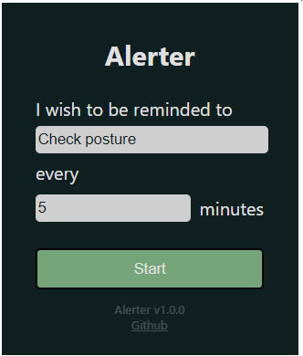
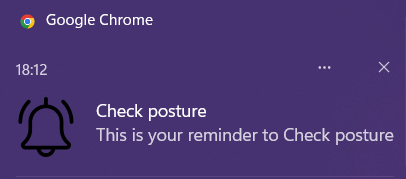
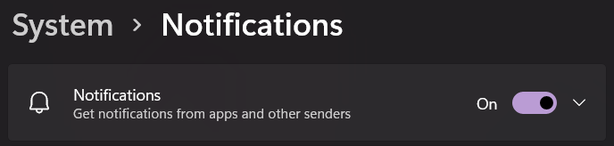

# alerter  
### This is a small Google Chrome extension I made to remind me of little things periodically.

## How to use
---
* Type what you want to be reminded of, and how often  
  
      
  
* Hit "Start"  
  
* You will be reminded via a Chrome notification  
  
      
  
* Make sure the "Get notifications from apps and other senders" setting is turned on in Windows System settings  
  
    

---
## How to install [WIP]
* Clone this repository. A directory named "alerter" will be created
  
        git clone https://github.com/shreyasdethe/alerter.git

* Open Google Chrome Extensions popup menu (the puzzle piece) > Manage Extensions
* Make sure "Developer Options" in the top right is turned on
* Click "Load Unpacked Extension"
* Select the directory **alerter**